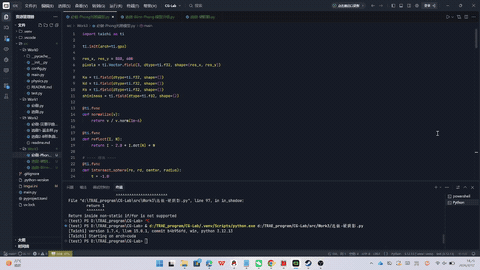
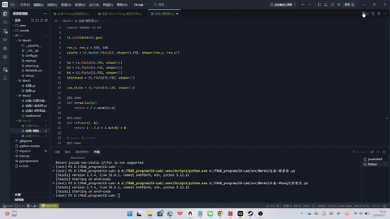
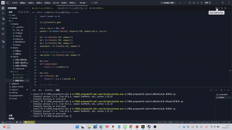

# 📘 基于 Taichi 的 Phong / Blinn-Phong 光照与阴影实验

## 📌 项目简介

本实验基于 Taichi 实现了一个简易的光线投射（Ray Casting）渲染器，通过逐步扩展实现以下内容：

- 必做实验：Phong 光照模型
- 选做实验 1：Blinn-Phong 模型升级
- 选做实验 2：硬阴影（Hard Shadow）

通过本实验可以直观理解局部光照模型的组成及其对渲染效果的影响。

---

## 🧠 实验原理

本实验基于经典的 **Phong 光照模型**：

I = I_ambient + I_diffuse + I_specular

- **环境光（Ambient）**：模拟全局均匀光照  
- **漫反射（Diffuse）**：满足 Lambert 定律  
- **镜面反射（Specular）**：描述高光效果  

在选做实验中进一步扩展：

- 使用 **Blinn-Phong 模型**（半程向量 H）
- 引入 **Shadow Ray 实现硬阴影**

---

## 🧪 实验内容

---

# ✅ 必做实验：Phong 光照模型

### 📌 实现内容

- 使用光线投射构建场景：
  - 红色球体（左）
  - 紫色圆锥（右）
- 实现：
  - 光线-几何体求交
  - 深度测试（Z-buffer 思想）
  - Phong 光照模型
- 提供 UI 控件调节参数：
  - Ka（环境光）
  - Kd（漫反射）
  - Ks（镜面反射）
  - Shininess（高光指数）

---

### 🎬 实验效果

---

### 📊 实验现象

- 增大 Ka → 整体亮度提高  
- 增大 Kd → 表面明暗对比增强  
- 增大 Ks → 高光更明显  
- 增大 Shininess → 高光更集中、更锐利  

---

# ⭐ 选做实验 1：Blinn-Phong 模型升级

---

### 📌 实现内容

在原 Phong 模型基础上：

- 引入半程向量：

H = normalize(L + V)

- 替换镜面反射计算：

I_specular = Ks * max(0, N · H)^n

- 支持 Phong / Blinn-Phong 切换对比

---

### 🎬 实验效果

---

### 📊 高光区域边缘视觉差异分析（重点）

在高光区域边缘，尤其是光线与视线夹角较大（大入射角）时：

- **Phong 模型**：
  - 高光容易迅速减弱甚至消失  
  - 高光边缘较锐利  
  - 对视角变化较敏感  

- **Blinn-Phong 模型**：
  - 高光衰减更平滑  
  - 在大入射角下仍保持一定亮度  
  - 高光区域更宽、过渡更自然  

👉 总体而言，Blinn-Phong 模型在视觉上更加稳定、真实。

---

# 🌑 选做实验 2：硬阴影（Hard Shadow）

---

### 📌 实现内容

在光照计算中引入 Shadow Ray（阴影射线）：

- 在交点处向光源发射一条射线
- 判断该射线是否被其他物体遮挡
- 若被遮挡：
  - 仅计算环境光（Ambient）
- 否则：
  - 计算完整光照（Ambient + Diffuse + Specular）

---

### 🎬 实验效果

---

### 📊 实验现象

- 物体之间产生明显遮挡关系  
- 阴影边界清晰（硬阴影）  
- 阴影区域仅保留环境光，明显变暗  

---

### ⚠️ 特点说明

- 阴影边缘无过渡（无半影）  
- 属于理想点光源产生的“硬阴影”  

---

# 🧩 项目结构
