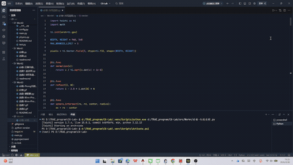
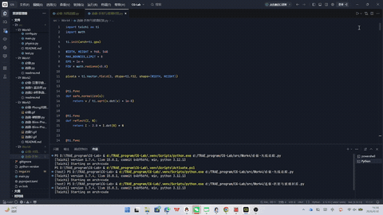
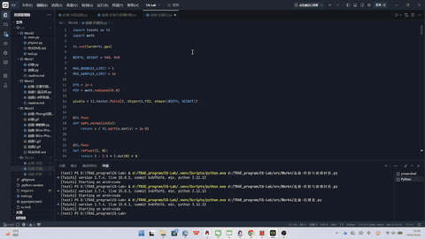

# Whitted-Style Ray Tracing 实验

## 1. 实验简介

本实验使用Taichi实现了一个简化版Whitted-Style光线追踪渲染器。程序从摄像机发射主光线，计算光线与场景物体的交点，并根据材质类型生成阴影、反射或折射效果。

## 2. 基础实验内容

基础版本中搭建了一个简单三维场景，包括：

- 无限地面平面，位置为 `y = -1`；
- 左侧红色漫反射球；
- 右侧银色镜面球；
- 黑白棋盘格地面；
- 可移动点光源；
- 可调节最大光线弹射次数。

程序中使用主光线进行物体求交。对于漫反射物体，使用 Phong 光照模型计算颜色；对于镜面物体，根据反射公式生成新的反射光线继续追踪。

反射方向公式为：

```text
R = I - 2 * dot(I, N) * N
```

其中I为入射方向，N为表面法线，R为反射方向。

运行结果：


---

## 3. 硬阴影实现

在计算漫反射表面的光照时，程序会从交点向光源方向发射一条阴影射线。如果阴影射线在到达光源之前击中其他物体，则说明该点位于阴影中，只保留环境光。

为了避免阴影射线和自身表面立即相交，代码中将射线起点沿法线方向偏移一个很小的值：

```python
shadow_origin = point + normal * EPS
```

这样可以解决常见的 Shadow Acne 自相交问题。

---

## 4. GPU 迭代式光线追踪

传统 Whitted 光线追踪常用递归实现，但 GPU 上不适合大量递归。因此本实验使用 `for` 循环模拟光线的多次弹射。

主要变量包括：

- `final_color`：累计最终颜色；
- `throughput`：记录光线经过反射或折射后的能量衰减。

当光线击中镜面或玻璃材质时，更新光线起点和方向，继续下一次循环；当击中漫反射物体或背景时，累加颜色并结束追踪。

---

## 5. 选做任务 1：玻璃折射

玻璃折射版本将左侧红色漫反射球改为了玻璃球，并根据 Snell's Law 计算折射方向。

程序会判断光线是从空气进入玻璃，还是从玻璃射出空气。当折射计算中出现`k < 0`时，说明发生全反射，此时程序不再生成折射光线，而是改为生成反射光线继续追踪。

玻璃版本中还提供了`Glass IOR`滑块，可以调节玻璃折射率。通常折射率设置为`1.5`左右时效果较明显。

运行结果：


---

## 6. 选做任务 2：MSAA 抗锯齿

MSAA 版本用于解决物体边缘、阴影边缘和棋盘格边缘的锯齿问题。

基础版本中每个像素只发射一条主光线，而 MSAA 版本在每个像素内部随机采样多个点，并对多条光线的颜色结果取平均。

核心思想如下：

```python
jitter_x = ti.random(ti.f32)
jitter_y = ti.random(ti.f32)
```

通过随机偏移采样点，使每个像素内可以发射多条主光线：

```python
u = (2.0 * (i + jitter_x) / WIDTH - 1.0) * aspect * scale
v = (2.0 * (j + jitter_y) / HEIGHT - 1.0) * scale
```

最后将多次采样结果求平均：

```python
final_color = color_sum / used_samples
```

当 `Samples Per Pixel` 增大时，边缘会更加平滑，但运行速度会下降。

运行结果 GIF：


---

## 7. 实验总结

本实验实现了一个基础的 Whitted-Style 光线追踪渲染器，完成了主光线求交、Phong 光照、硬阴影、镜面反射和 UI 交互控制。为了适配 GPU 并行计算，代码使用循环代替递归来实现多次光线弹射。

在选做任务中，进一步实现了玻璃材质的折射与全反射，以及基于随机多重采样的 MSAA 抗锯齿。通过本实验，可以更直观地理解主光线、阴影射线、反射射线和折射射线在光线追踪中的作用。