基于 PyTorch3D 的可微渲染与 Mesh 优化实验。

本实验通过 Soft Rasterization 与 Mesh Regularization，实现从初始球体到目标奶牛模型的三维形状优化，并进一步尝试联合纹理优化（选做部分）。

---

# 一、实验环境

## 平台

- ModelScope Notebook（阿里云魔搭社区）

## 环境配置

- Python 3.10
- PyTorch
- PyTorch3D
- CUDA

## 安装命令

```python
!pip install --upgrade pip

!pip install fvcore iopath matplotlib ninja

!pip install "git+https://gitee.com/hongwenzhang/pytorch3d.git" --no-build-isolation
```

---

# 二、实验原理

本实验基于：

## 1. Soft Rasterization

传统硬光栅化中：

- 像素属于三角形内部或外部
- 边界不可导
- 会导致梯度消失

因此采用：

```math
A(d)=sigmoid(d/\sigma)
```

实现边界平滑化，从而实现可微渲染。

---

## 2. Mesh Optimization

通过梯度下降不断优化：

- 顶点坐标
- 网格形状

使初始球体逐渐逼近目标奶牛模型。

---

## 3. Mesh Regularization

为了防止 Mesh 崩坏，引入：

- Laplacian Smoothing
- Edge Length Penalty
- Normal Consistency

共同约束网格平滑性与几何合理性。

---

# 三、项目结构

```text
project/
│
├── mesh_optimization.ipynb
├── cow.obj
│
├── results/
│   ├── meshes/
│   ├── images/
│   ├── final_cow.obj
│   └── loss_curve.png
```

---

# 四、必做部分：

## 实验目标

仅基于多视角剪影（Silhouette）监督：

- 优化球体顶点
- 重建奶牛几何形状

---

## 核心方法

使用：

```python
SoftSilhouetteShader
```

渲染目标剪影图，并通过：

```python
MSE Loss
```

计算预测剪影与目标剪影之间的误差。

---

## 优化过程截图

### 初始状态（Epoch 0）
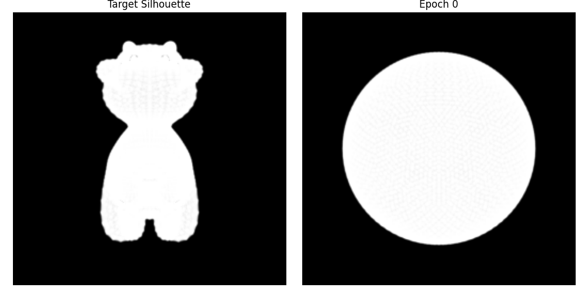

---

### 中间优化过程（Epoch 100）
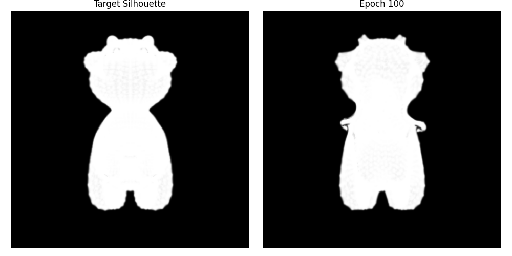

---

### 最终优化结果（Epoch 299）
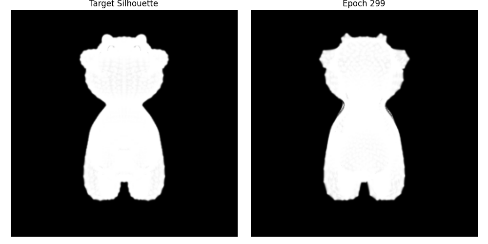
---

## Loss 曲线

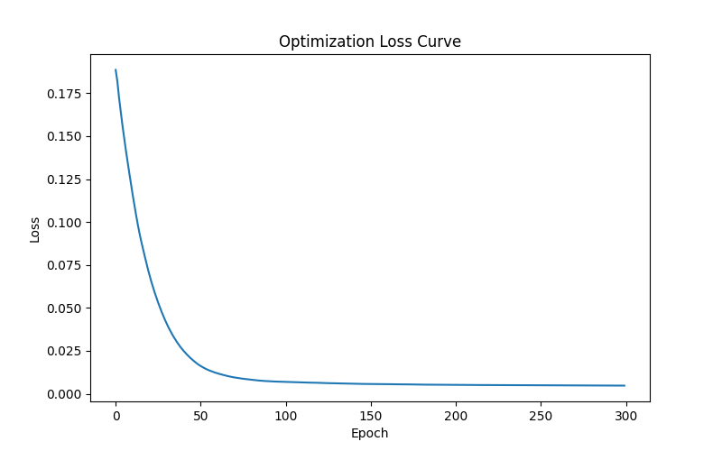
---
## 运行过程

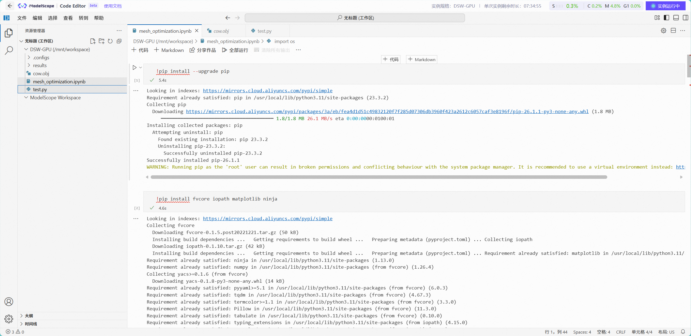
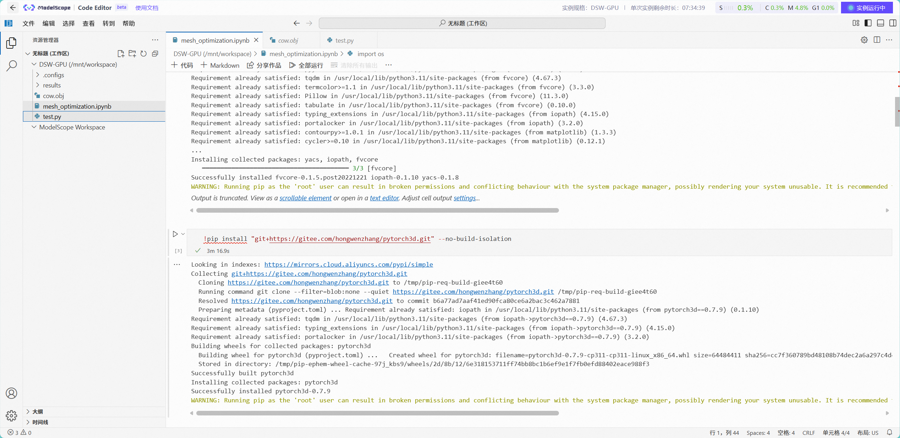
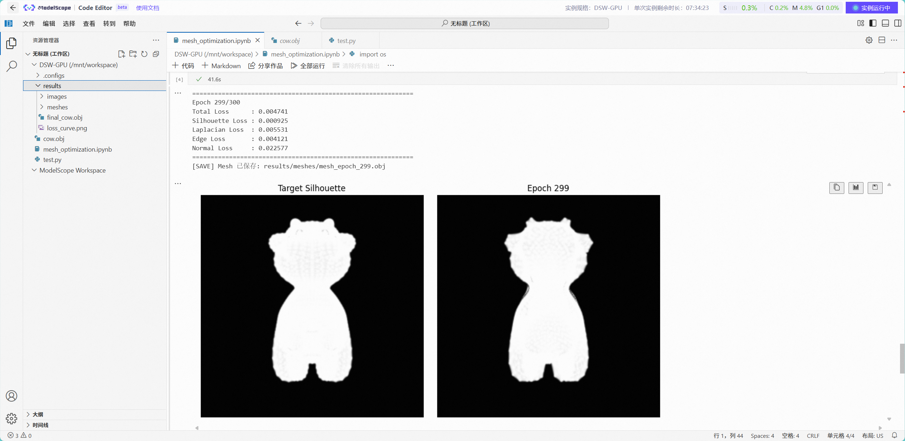
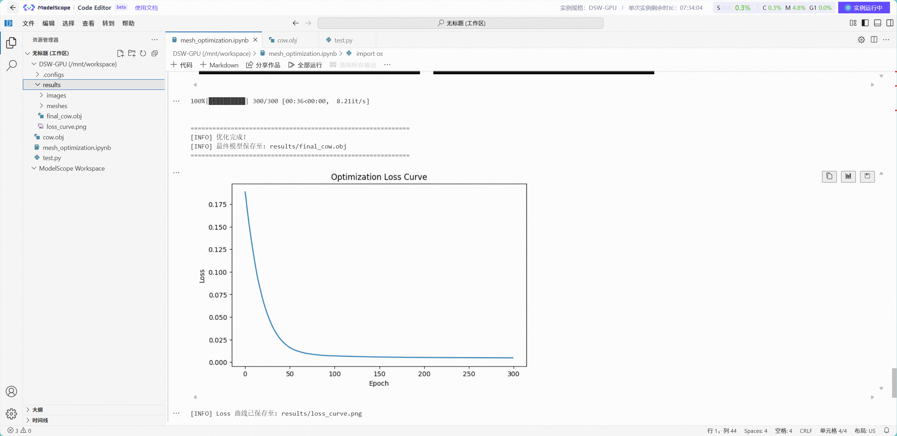

## 实验结果分析

实验中，初始球体在多视角剪影监督下逐渐发生形变，最终能够较好地恢复奶牛的整体几何结构。

同时，加入的：

- 拉普拉斯平滑
- 边长约束
- 法线一致性约束

有效避免了：

- 网格尖刺
- 面片塌陷
- 顶点交叉

说明正则化项对于可微 Mesh 优化具有重要作用。

---

# 五、选做部分：联合 Shape + Texture Optimization

## 实验目标

在形状优化基础上，进一步加入：

- RGB 图像监督
- 顶点颜色优化

实现：

- 几何恢复
- 纹理恢复

联合优化。

---

## 核心方法

使用：

```python
SoftPhongShader
```

替代：

```python
SoftSilhouetteShader
```

从而渲染：

- RGB 图像
- 光照效果
- 表面颜色

同时优化：

```python
deform_verts
vertex_colors
```

---

## 运行结果

### 初始状态

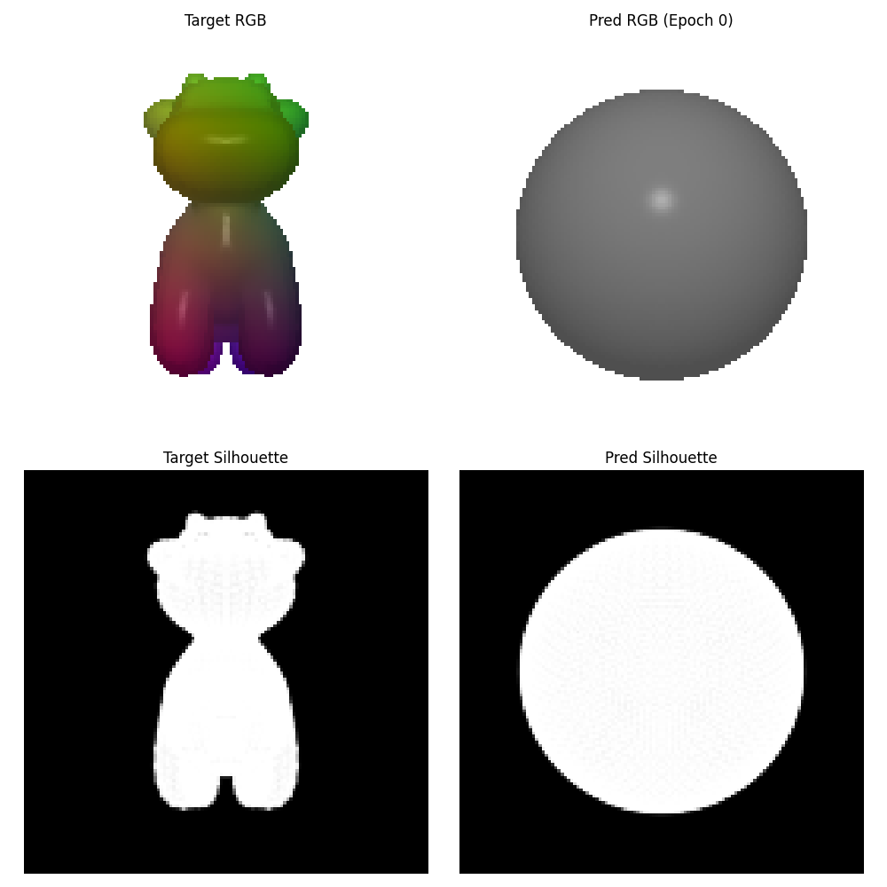

---

### 中间优化过程

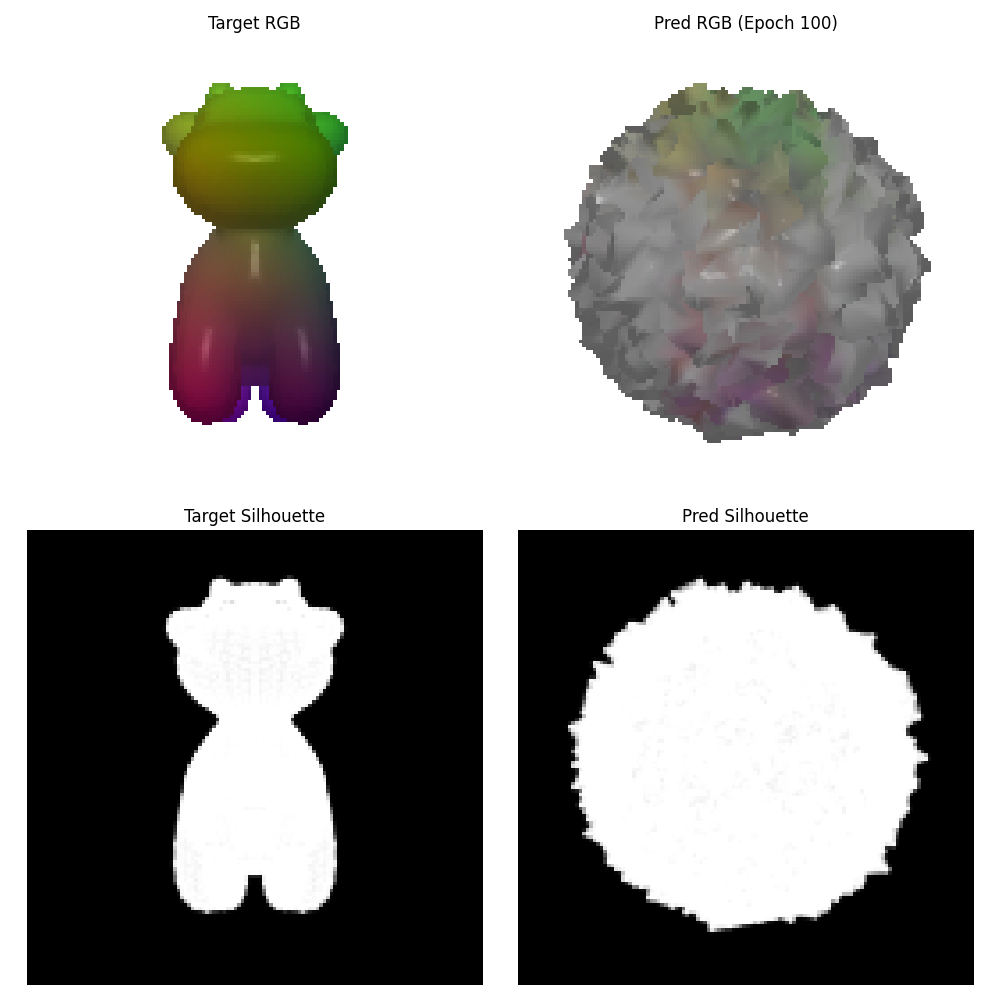

---

### 最终运行结果

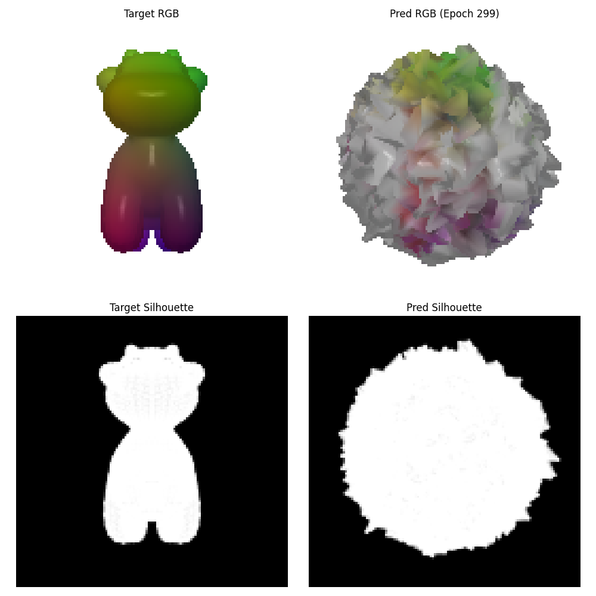

---

## Loss 曲线


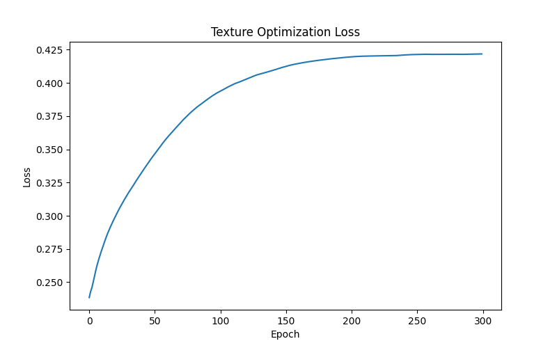
---

未能得到理想的纹理重建结果。
而且生图很诡异。。。。。。
---

