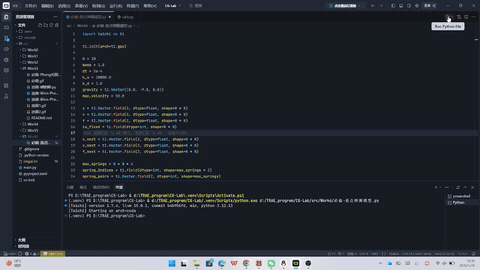
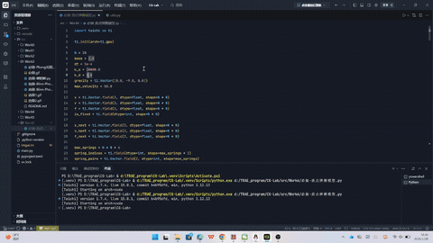
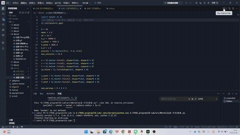
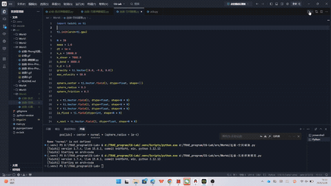

202411081067 刘原江 2024级计算机科学与技术

# Work6 - 质点弹簧布料仿真

基于 Taichi 框架实现的质点-弹簧布料仿真系统，涵盖三种数值积分方法的对比、完整弹簧模型以及球体碰撞响应。

---

## 环境依赖

- Python 3.12
- Taichi 1.7.4

```bash
pip install taichi==1.7.4
```

---

## 必做：质点-弹簧模型

实现了基于 Hooke's Law 的布料仿真，支持三种数值积分方法的实时切换与对比。

### 实现内容

- **结构弹簧**：水平 + 垂直方向相邻质点连接
- **三种积分器**：
  - 显式欧拉（Explicit Euler）：计算最快，稳定性差，大时间步长下容易发散
  - 半隐式欧拉（Semi-Implicit Euler）：先更新速度再更新位置，稳定性较好
  - 隐式欧拉（Implicit Euler）：定点迭代近似求解，稳定性最佳
- **速度钳制**：限制最大速度防止数值爆炸
- **GGUI 交互面板**：实时切换积分方法、暂停、重置

### 运行效果
阻尼1：


阻尼5：


---

## 选做一：完善弹簧模型

在结构弹簧基础上补充剪切弹簧与弯曲弹簧，观察布料形态变化。

### 三类弹簧说明

| 类型 | 连接方式 | 作用 |
|------|----------|------|
| 结构弹簧 Structural | 水平 / 垂直相邻，间距 1 | 维持布料基本形状 |
| 剪切弹簧 Shear | 对角线相邻，间距 √2 | 抵抗菱形剪切变形 |
| 弯曲弹簧 Bending | 水平 / 垂直跨一格，间距 2 | 抵抗布料折叠弯曲 |

### 运行效果


---

## 选做二：空间碰撞

在场景中放置一个球体，实现布料质点与球体的碰撞检测与响应。

### 碰撞处理逻辑

1. 计算质点到球心的距离
2. 若距离小于球体半径，将质点沿法线方向推出到球面
3. 速度分解为法向分量与切向分量：
   - 法向分量（朝向球内）清零
   - 切向分量乘以 `(1 - friction)` 模拟摩擦减速

控制面板提供X/Y/Z六向移动按钮，可交互移动球体观察碰撞效果。

### 运行效果


---
