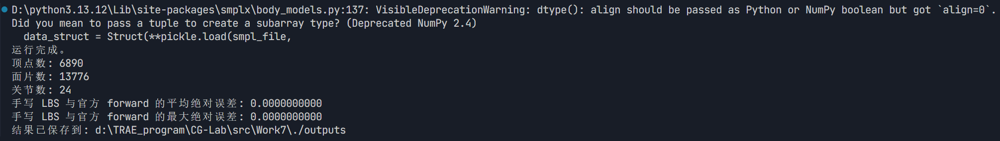
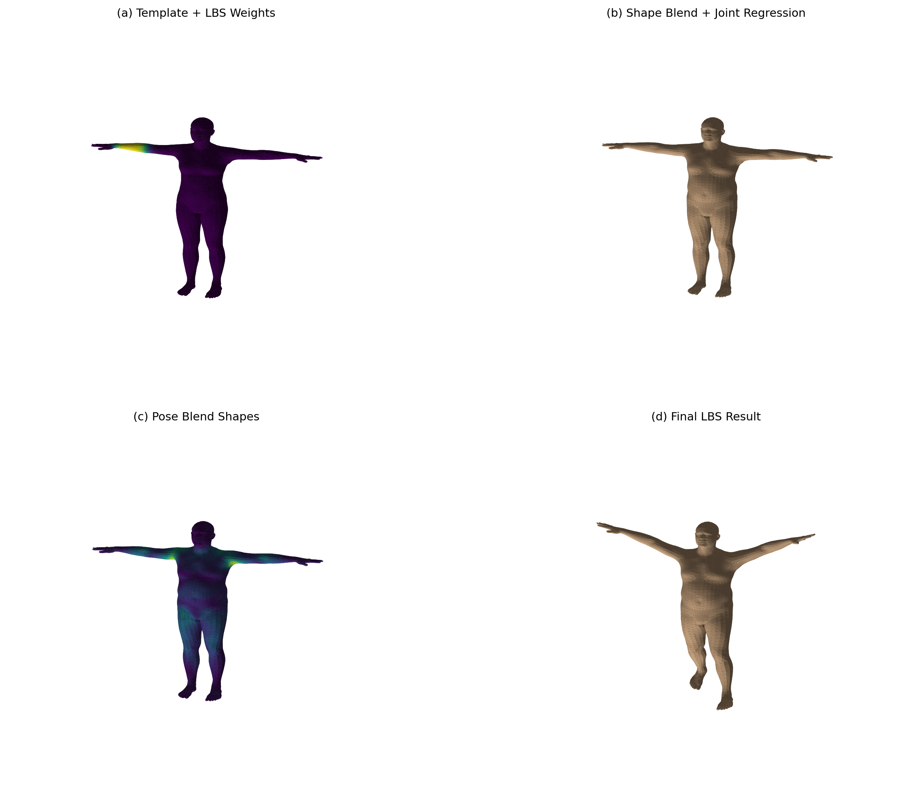
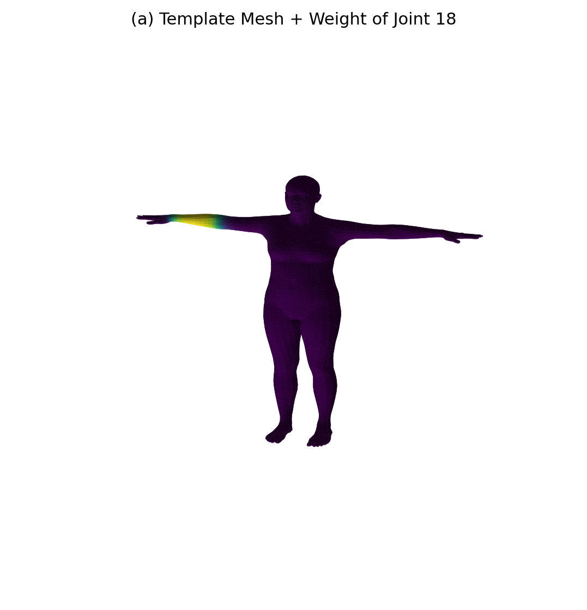
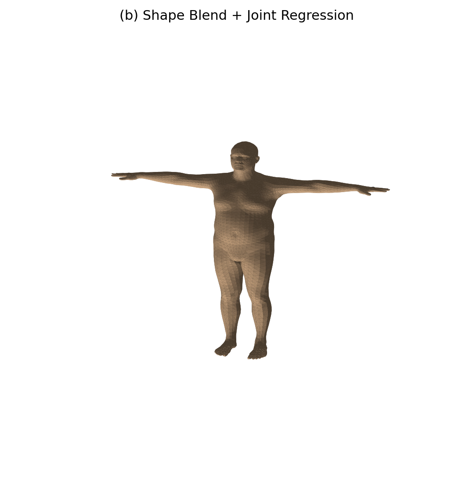
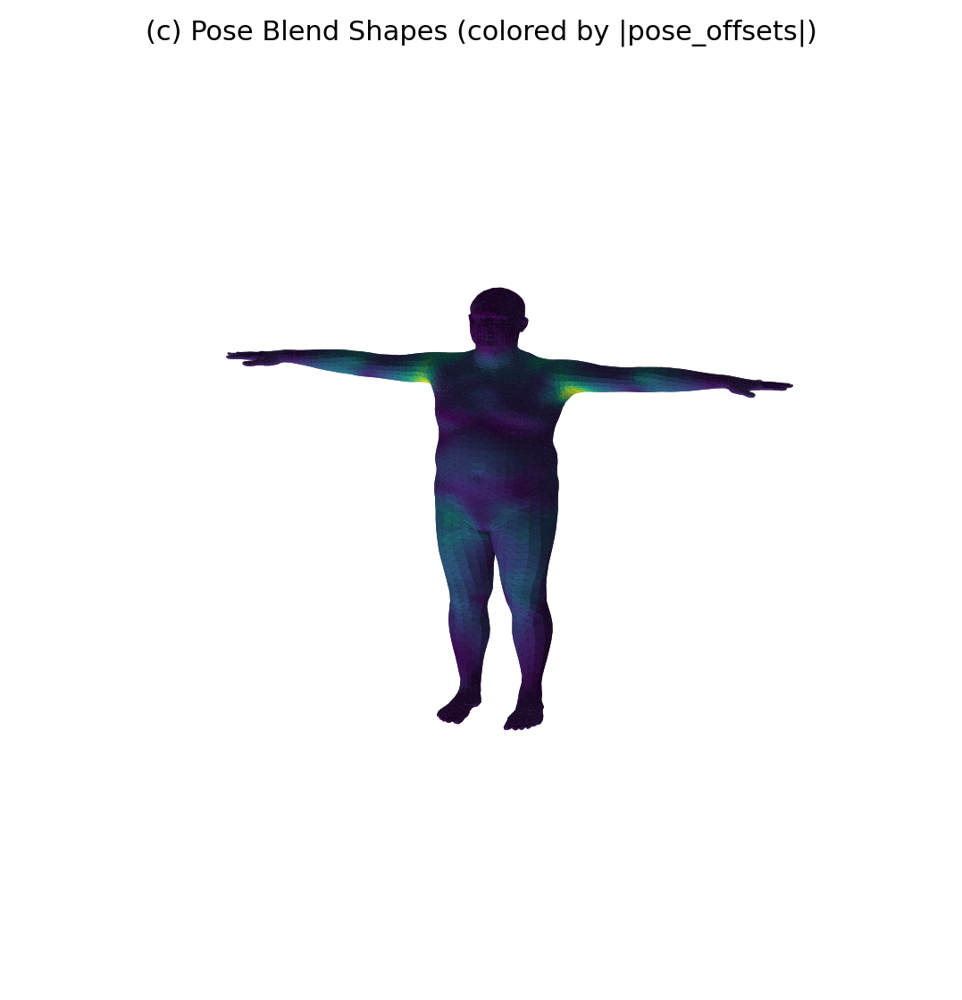
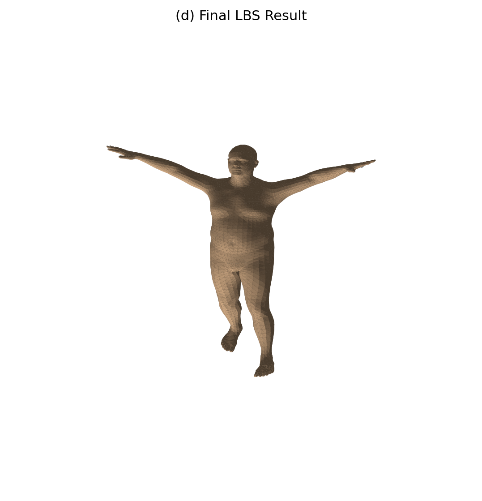
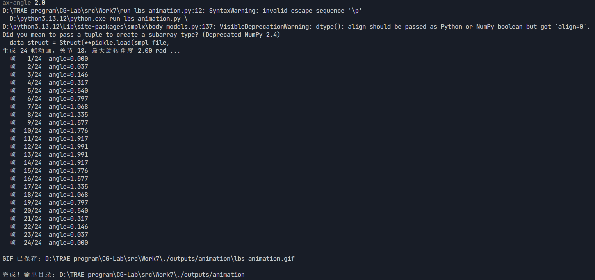
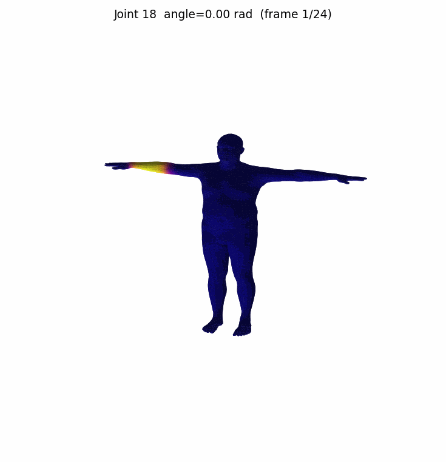

202411081067 刘原江 2024级计算机科学与技术

# 计算机图形学实验 —— SMPL LBS 蒙皮可视化

## 环境依赖

- Python 3.13
- torch / smplx / numpy / matplotlib / Pillow

## 目录结构

```
lbs_lab/
├── run_lbs_lab.py          # 必做：LBS 四阶段可视化
├── run_lbs_animation.py    # 选做：姿态动画
├── models/
│   └── smpl/
│       └── SMPL_NEUTRAL.pkl
└── outputs/
```

---

## 必做部分

### 运行命令

```bash
python run_lbs_lab.py --model-dir ./models --out-dir ./outputs --joint-id 18
```

### 终端输出



### 生成结果

| 文件 | 说明 |
|------|------|
| `stage_a_template_weights.png` | 模板网格 + 关节 18 的 LBS 权重热力图 |
| `stage_b_shaped_joints.png` | 形状校正后的网格 + 回归关节点 |
| `stage_c_pose_offsets.png` | 姿态校正偏移量可视化 |
| `stage_d_lbs_result.png` | 最终 LBS 蒙皮结果 |
| `comparison_grid.png` | 四阶段对比总图 |
| `all_joint_weights.png` | 全关节主导权重分布图 |
| `summary.txt` | 模型信息 + 手写 LBS 与官方误差 |







---

## 选做部分：姿态动画

固定 shape 参数，让左肘关节（Joint 18）从 0 逐渐旋转到约 115°，生成 24 帧动画并导出 GIF。网格颜色表示该关节的 LBS 权重，可观察到权重越高的区域被骨骼带动越明显。

### 运行命令

```bash
python run_lbs_animation.py --model-dir ./models --out-dir ./outputs/animation --joint-id 18 --frames 24 --max-angle 2.0
```

### 终端输出


### 动画结果

